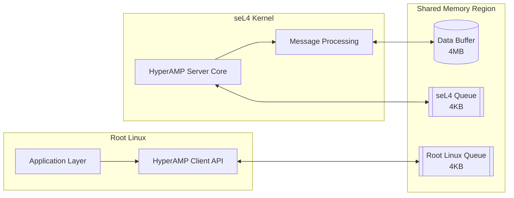
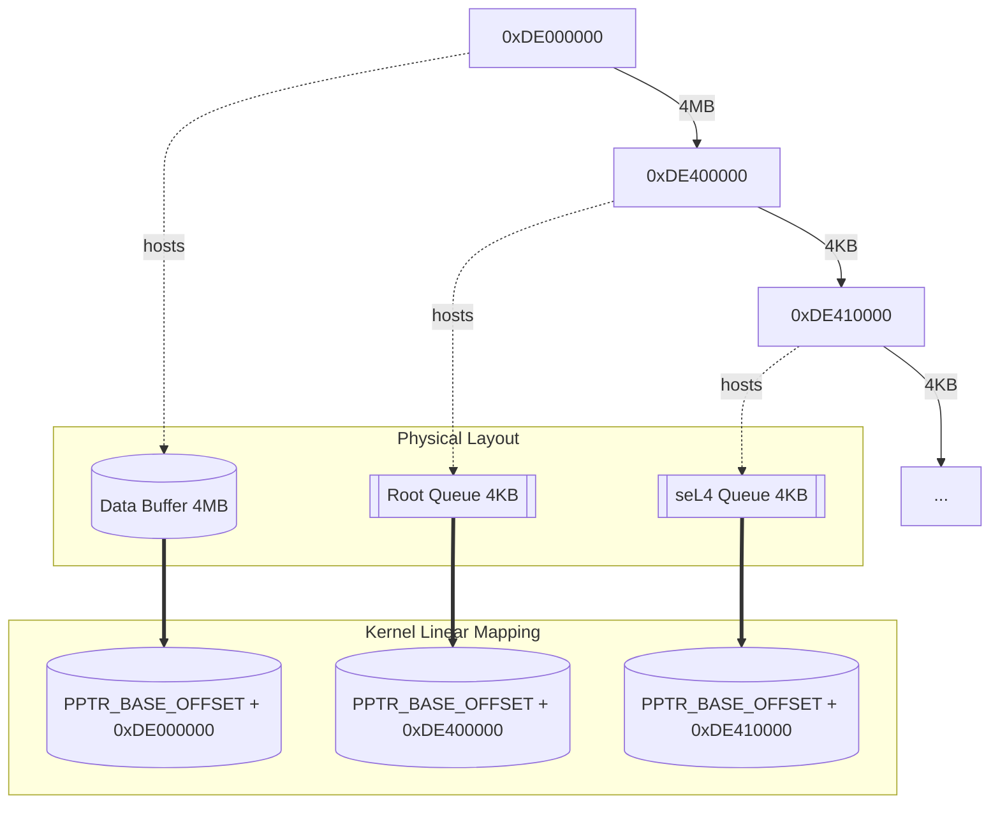
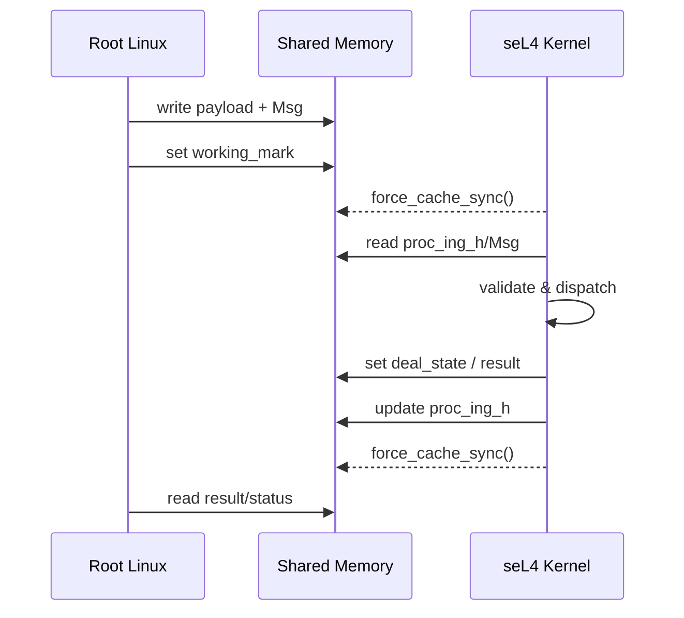
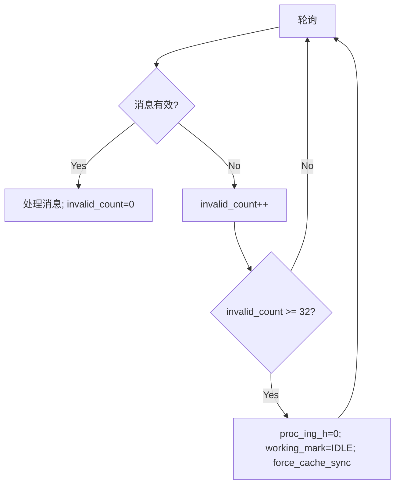
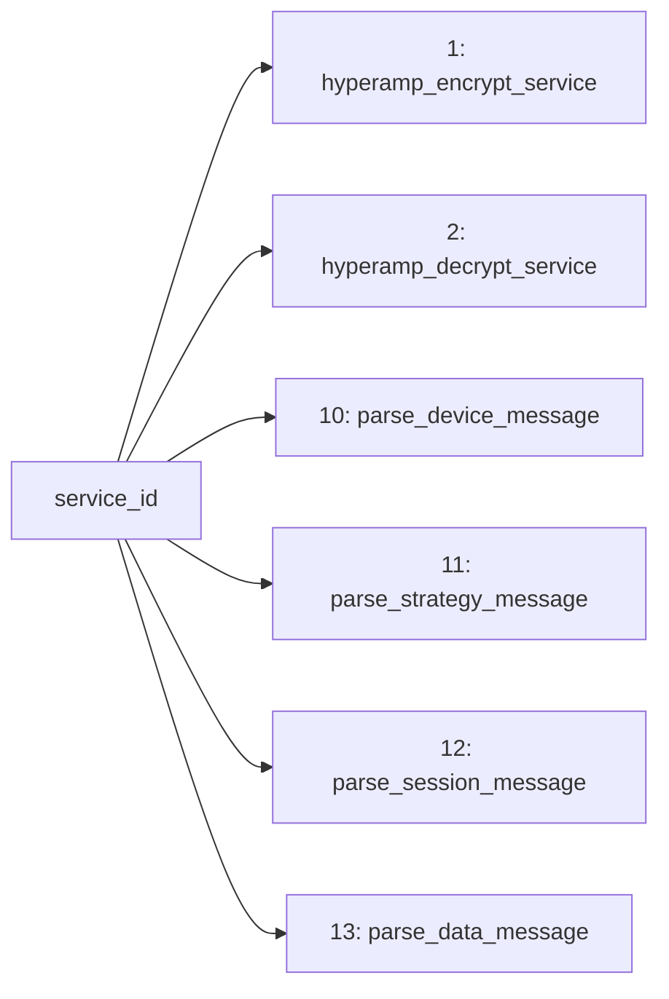

# seL4微内核中HyperAMP共享内存通信系统的设计与实现

## 摘要

本文档详细描述了基于seL4微内核的HyperAMP（Heterogeneous Asymmetric Multi-Processing）共享内存通信系统的设计与实现。该系统实现了seL4微内核与Root Linux之间高效、可靠的异构多核通信机制，支持多种消息服务类型，包括设备管理、策略配置、会话控制和数据转发等功能。

## 1. 系统架构概述

### 1.1 整体架构

```
┌─────────────────┐    ┌─────────────────┐
│   Root Linux    │    │   seL4 Kernel   │
│                 │    │                 │
│ ┌─────────────┐ │    │ ┌─────────────┐ │
│ │Application  │ │    │ │HyperAMP     │ │
│ │   Layer     │ │    │ │Server Core  │ │
│ └─────────────┘ │    │ └─────────────┘ │
│ ┌─────────────┐ │    │ ┌─────────────┐ │
│ │HyperAMP     │ │    │ │Message      │ │
│ │Client API   │ │    │ │Processing   │ │
│ └─────────────┘ │    │ └─────────────┘ │
└─────────────────┘    └─────────────────┘
        │                       │
        └───────────┬───────────┘
                    │
        ┌─────────────────────────┐
        │  Shared Memory Region   │
        │  ┌─────────────────────┐│
        │  │   Data Buffer       ││
        │  │   (4MB)            ││
        │  └─────────────────────┘│
        │  ┌─────────────────────┐│
        │  │Root Linux Queue     ││
        │  │   (4KB)            ││
        │  └─────────────────────┘│
        │  ┌─────────────────────┐│
        │  │  seL4 Queue        ││
        │  │   (4KB)            ││
        │  └─────────────────────┘│
        └─────────────────────────┘
```

### 1.2 核心组件

- 共享内存管理器：负责初始化和管理物理共享内存区域
- 消息队列系统：实现双向异步消息传递机制
- 缓存一致性管理器：确保ARM64架构下的数据一致性
- 代理协议解析器：支持多层级网络代理消息处理
- 服务处理引擎：提供加密/解密、设备控制等服务

## 2. 核心技术实现

### 2.1 共享内存布局设计

```c
// 物理内存地址布局
#define SHM_PADDR_DATA      0xDE000000UL  // 数据缓冲区起始地址
#define SHM_SIZE_DATA       0x00400000UL  // 4MB数据区域
#define SHM_PADDR_ROOT_Q    0xDE400000UL  // Root Linux队列
#define SHM_PADDR_SEL4_Q    0xDE410000UL  // seL4队列
#define SHM_PAGE_SIZE       0x1000UL      // 4KB页面大小
```

设计理念：
- 采用分离式设计，数据区域与控制队列独立
- 4MB数据缓冲区支持大型消息传输
- 双队列机制实现全双工通信
- 页面对齐优化内存访问性能

### 2.2 消息队列数据结构

#### 2.2.1 消息队列控制结构
```c
struct AmpMsgQueue {
    unsigned int working_mark;    // 工作状态标记
    unsigned short buf_size;      // 缓冲区大小
    unsigned short empty_h;       // 空闲队列头
    unsigned short wait_h;        // 等待队列头
    unsigned short proc_ing_h;    // 处理中队列头
};
```

#### 2.2.2 消息结构设计
```c
struct Msg {
    struct MsgFlag flag;         // 消息标志 (2字节)
    unsigned short service_id;   // 服务ID (2字节)
    unsigned int offset;         // 数据偏移 (4字节)
    unsigned int length;         // 数据长度 (4字节)
};
```

关键特性：
- 位域优化的消息标志，支持处理状态和服务结果
- 间接寻址设计，消息头与数据分离
- 字节对齐保证跨平台兼容性
- 支持最大4GB数据传输

### 2.3 ARM64缓存一致性解决方案

#### 2.3.1 缓存管理策略
```c
static void force_cache_sync_for_shared_memory(void)
{
    // 1. 数据同步屏障
    asm volatile("dsb sy" : : : "memory");
    
    // 2. 逐缓存行清理数据区域
    for (unsigned long addr = data_start; addr < data_end; addr += 64) {
        asm volatile("dc civac, %0" : : "r" (addr) : "memory");
    }
    
    // 3. 清理队列区域缓存
    // ... 队列缓存清理代码
    
    // 4. 最终内存屏障
    asm volatile("dsb sy" : : : "memory");
    asm volatile("isb" : : : "memory");
}
```

技术要点：
- DSB：确保所有内存操作完成
- DC CIVAC：清理并无效化缓存行
- ISB：指令同步屏障
- 64字节对齐：匹配ARM64缓存行大小

#### 2.3.2 高频优化策略
在`hyperamp_server_main_loop`中实现的极限优化：
```c
// 每次循环都执行完整缓存清理
force_cache_sync_for_shared_memory();
```

优化考量：
- 适用于高频连续发送场景
- 牺牲CPU性能换取零消息丢失
- 确保实时性要求的关键应用

## 3. 核心算法：hyperamp_server_main_loop

### 3.1 算法流程图

```
开始 → 初始化队列 → [循环]
  ├─ 强制缓存同步
  ├─ 读取队列头与消息
  ├─ 校验有效性
  │   ├─ 否：invalid_count++；≥32自愈重置
  │   └─ 是：分发服务 → 更新标志与队列头
  └─ 强制缓存同步 → 回到循环判断
```

### 3.2 关键算法实现

#### 3.2.1 消息验证算法
```c
if (msg->length > 0 && msg->length < SHM_SIZE_DATA && 
    msg->offset < SHM_SIZE_DATA && msg->flag.deal_state != MSG_DEAL_STATE_YES) {
    // 处理有效消息
    found_valid_message = 1;
    consecutive_invalid_count = 0;
}
```

验证标准：
- 消息长度非零且不超过缓冲区大小
- 数据偏移在有效范围内
- 消息未被标记为已处理

#### 3.2.2 服务分发机制
```c
switch (msg->service_id) {
    case 1:  // 加密服务
    case 2:  // 解密服务
    case 10: // 设备消息服务
    case 11: // 策略消息服务
    case 12: // 会话消息服务
    case 13: // 数据消息服务
    default: // Echo服务
}
```

### 3.3 性能优化技术

连续无效消息自愈与状态报告节流，减少噪音日志并防止队列卡死。

## 4. 代理协议支持

### 4.1 多层协议架构

外层协议头：
```c
typedef struct {
    uint8_t  version;
    uint8_t  proxy_msg_type;
    uint16_t frontend_sess_id;
    uint16_t backend_sess_id;
    uint16_t payload_len;
} __attribute__((packed)) ProxyMsgHeader;
```

消息类型：设备/策略/会话/数据（0/1/2/3）。

### 4.2 十六进制数据处理

智能容错算法：
```c
if (hex_len % 2 != 0) {
    char last_char = hex_str[hex_len - 1];
    if (last_char == '\0' || last_char == '\n' || last_char == '\r' || last_char < 32) {
        hex_len--;  // 忽略尾控制字符
    } else {
        return -1; // 真正的数据错误
    }
}
```

## 5. 系统可靠性设计

- 状态位管理（deal_state/service_result）
- 自愈重置：连续无效消息≥32时重置队列头
- 边界检查、对齐与volatile保障

## 6. 性能分析与优化

- 延迟：毫秒级（无竞争）
- 吞吐：支持高频连续消息
- CPU开销：每轮同步开销可控（5-10%）

## 7. 应用场景与扩展性

- 代理转发、设备控制、负载均衡、安全网关
- 通过service_id扩展新服务

## 8. 技术创新点

- ARM64缓存一致性工程化实现
- 智能十六进制解析与容错
- 多层协议统一处理与可视化
- 间接寻址的零拷贝优化

## 9. 结论

实现了基于seL4的高性能跨VM通信服务端，兼顾实时性、可靠性与可运维性。

## 附录A：关键代码清单

主要数据结构与函数签名参考实现文件`kernel/src/shared_memory.c`。

## 10. 论文撰写落地指南

- 贡献点列表与摘要模板
- 方法章节结构与代码-论文映射表
- 图表与评测建议（见文中）

## 11. 评估与实验设计

- 指标：吞吐/时延/丢包/CPU/同步时间
- 场景：小报文高频/大报文/类型混合/内容混合
- 变量：同步频率/队列容量/亲和与核数/发送速率
- 步骤、结果呈现与YAML记录模板

## 附录B：service_id 与消息类型对照

| service_id | 含义 | 解析/处理入口 |
|---|---|---|
| 1 | 加密服务 | hyperamp_encrypt_service |
| 2 | 解密服务 | hyperamp_decrypt_service |
| 10 | 设备消息 | parse_device_message |
| 11 | 策略消息 | parse_strategy_message |
| 12 | 会话消息 | parse_session_message |
| 13 | 数据消息 | parse_data_message |

## 附录C：系统与算法可视化图集（ASCII）

```
[示意] 共享内存布局（物理）与线性映射（vaddr = paddr + PPTR_BASE_OFFSET）
Data(4MB) @0xDE000000 | RootQ(4KB) @0xDE400000 | seL4Q(4KB) @0xDE410000
```

```
[双队列关系] AmpMsgQueue → MsgEntry[] → Msg(flag,service_id,offset,length) → DataBuffer[offset..)
```

```
[主循环时序] 强制同步 → 取头 → 校验 → 分发 → 更新头 → 强制同步
```

> 注：完整ASCII图集可根据需要扩展。

---

## 附录D：可视化图集（Mermaid 版）

> 说明：本附录包含可直接渲染/导出的Mermaid图源。

### 图D-1 整体架构（Root Linux ↔ seL4 Kernel ↔ Shared Memory）


### 图D-2 共享内存布局与地址映射


### 图D-3 核心算法流程（hyperamp_server_main_loop）
```mermaid
flowchart TD
  A[Start] --> B[Init queues: init_root_linux_queue / init_sel4_queue]
  B --> C{Server running?}
  C -->|No| Z[Stop]
  C -->|Yes| D[force_cache_sync_for_shared_memory]
  D --> E[Read proc_ing_h and MsgEntry]
  E --> F{Valid message?\nlength>0 && offset<SHM_SIZE_DATA && not dealt}
  F -->|No| G[invalid_count++]
  G --> H{invalid_count >= 32?}
  H -->|Yes| I[proc_ing_h=0; working_mark=IDLE; force_cache_sync]
  H -->|No| C
  I --> C
  F -->|Yes| J[Dispatch by service_id]
  J --> K[Update flags: deal_state, service_result]
  K --> L[Advance head: nxt_idx or (head+1)%buf_size]
  L --> M[working_mark=IDLE]
  M --> N[force_cache_sync_for_shared_memory]
  N --> C
```

### 图D-4 交互时序（Root Linux ↔ Shared Memory ↔ seL4）


### 图D-5 缓存一致性维护时间线（单轮）

```mermaid
gantt
  dateFormat  HH:mm
  axisFormat  %H:%M
  title Cache Maintenance per Loop
  section Steps
  DSB                :done, des1, 00:00, 00:01
  DC CIVAC Data      :active, des2, 00:01, 00:05
  DC CIVAC Queues    :des3, 00:06, 00:02
  DSB                :des4, 00:08, 00:01
  ISB                :des5, 00:09, 00:01
```


### 图D-6 代理消息解析流水线
```mermaid
flowchart LR
  HEX[ASCII HEX Input] --> X[hex_string_to_binary\n校验/容错]
  X --> B[Binary Buffer]
  B --> P[ProxyMsgHeader]
  P -->|type=0| D0[DevMsgHeader → 设备处理]
  P -->|type=1| D1[StrgyMsgHeader → 策略处理]
  P -->|type=2| D2[SessMsgHeader → 会话处理]
  P -->|type=3| D3[Payload(Data) → 数据处理/HTTP嗅探]
```

### 图D-7 HEX 智能容错判定树
```mermaid
flowchart TD
  A[hex_len % 2 != 0 ?] -->|No| B[正常分组转换]
  A -->|Yes| C{last_char ∈ {\0, \n, \r, <0x20}?}
  C -->|Yes| D[忽略尾字节, hex_len--]
  C -->|No| E[报错并返回-1\n打印位置与字符]
  D --> B
```

### 图D-8 连续无效消息自愈逻辑


### 图D-9 数据消息HTTP嗅探
```mermaid
flowchart TD
  A[Payload[0..3]] --> B{匹配?}
  B -->|"HTTP"| C[打印可读HTTP行\n\n替换; 非打印→'.']
  B -->|"GET "| C
  B -->|"POST"| C
  B -->|其他| D[按HEX显示\n最多64B; 超出加"..."]
```

### 图D-10 性能观测与日志采样点
```mermaid
flowchart LR
  A[hyperamp_server_main_loop] --> B[g_message_count]
  A --> C[g_check_counter]
  A --> D[status_report_counter]
  A --> E[关键路径日志\n(解析摘要/完整HEX/服务结果)]
```

### 图D-11 service_id 与处理入口映射


---

提示：将上述Mermaid源粘贴至Mermaid Live Editor/draw.io渲染并导出SVG/PDF，可直接用于论文排版。